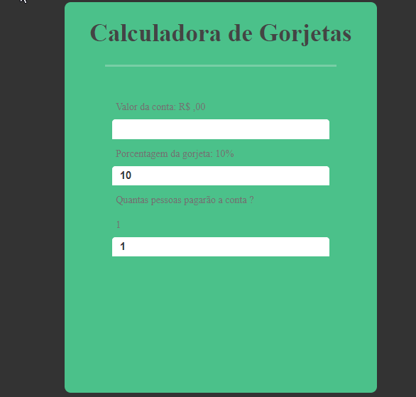

# Projeto Calculadora de Gorjetas
> ### Neste projeto foi utilizado as seguintes tecnologias

 ## React
 ## Javascript
 ## Html
 ## CSS

>1. Para baixar o projeto basta abrir seu terminal CMD ou gitBash
>2. Selecionar a pasta de destino
>3. Digitar git clone https://github.com/thiagomurgia/b7web-calculo-gorjeta.git
>4. pós a conclusão do download
>5. Basta abrir em seu terminal
>6. Digitar npm i para que sejam instaladas todas as dependências
>7. Após concluir o download de todas as dependências do projeto
>8. Digite em seu terminal ou em seu terminal integrado do vscode yarn start